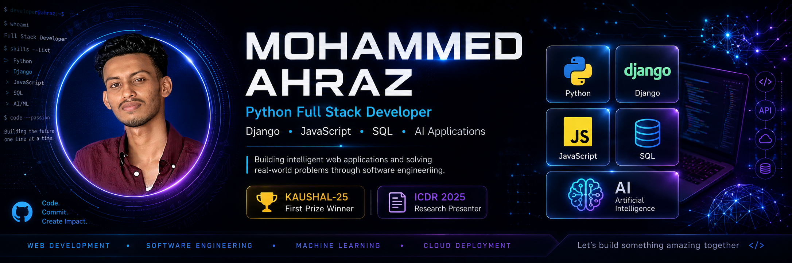

  

<h1 align="center">Hi 👋, I'm Mohammed Ahraz</h1>

<h3 align="center">
Python Full Stack Developer | Django • JavaScript • SQL • AI Applications
</h3>

<a href="YOUR_PORTFOLIO_LINK">
Portfolio
</a>
•
<a href="https://www.linkedin.com/in/mohammed-ahraz/">
LinkedIn
</a>
•
<a href="mailto:mhmmedahraz@gmail.com">
Email
</a>
•
<a href="https://github.com/mhmmedahraz18">
GitHub
</a>

---

# 🚀 About Me

I'm a Python Full Stack Developer passionate about building practical software solutions and intelligent web applications.

I enjoy working across the entire development lifecycle—from designing user interfaces to implementing backend systems and deploying complete applications.

### Highlights

- Python Full Stack Developer
- Strong interest in Django-based applications
- Passionate about AI-powered solutions
- Research Presenter at ICDR 2025
- KAUSHAL-25 First Prize Winner

---

# 💼 Experience

### 🏢 Software Development Intern
Knovista Technologies

Contributed to software development projects and gained practical industry experience.

### 🚀 Software Engineer Intern
GigLabs Pvt. Ltd.

Worked on modern web development projects and collaborated on software solutions using contemporary development practices.

### 💻 Python Full Stack Developer Training
QSpiders

Focused on Python, Django, SQL, JavaScript, frontend development, backend architecture, and project implementation.

---

# 🛠 Tech Stack

## Languages

- Python
- JavaScript
- SQL
- HTML5
- CSS3

## Frameworks & Libraries

- Django
- React
- Node.js
- Express.js

## Databases

- SQL Databases
- MongoDB

## Tools

- Git
- GitHub
- VS Code
- Postman
- Vercel

---

# 🌟 Featured Projects

## 🤖 RoboMigo

Campus Navigation and Information Assistance System

### Features

- Multilingual Voice Interaction
- Campus Navigation Assistance
- YOLO-based Person Detection
- AI-powered Information Support
- Interactive User Experience

---

## 🏢 Smart Asset Management System

Enterprise-style asset tracking and management platform built using Django.

### Features

- Asset Lifecycle Management
- Inventory Tracking
- Role-Based Access
- Administrative Dashboard
- Reporting and Analytics

---

## 🎬 Django MovieHub

Movie management platform developed with Django.

### Features

- Movie Catalog Management
- CRUD Operations
- Responsive User Interface
- Database Integration

---

## ⚽ Sports Club Management System

Sports management platform developed using PHP, HTML, CSS, JavaScript and SQL.

### Features

- Club Administration
- Player Registration
- Tournament Management
- Team Tracking

---

# 🏆 Achievements

🥇 First Prize — KAUSHAL-25 Project Competition & Expo

📄 Presented Research Paper:
"RoboMigo – Campus Navigation and Information Assistance"
at ICDR 2025

---

# 📚 Certifications

- Postman API Fundamentals Student Expert
- Python 101 for Data Science (IBM)

---

# 📫 Let's Connect

📧 Email:
mhmmedahraz@gmail.com

💼 LinkedIn:
https://www.linkedin.com/in/mohammed-ahraz/

🌐 Portfolio:
[YOUR_PORTFOLIO_LINK](https://ahraz-portfolio.vercel.app/)

🐙 GitHub:
https://github.com/mhmmedahraz18

---

⭐ Thanks for visiting my profile!
